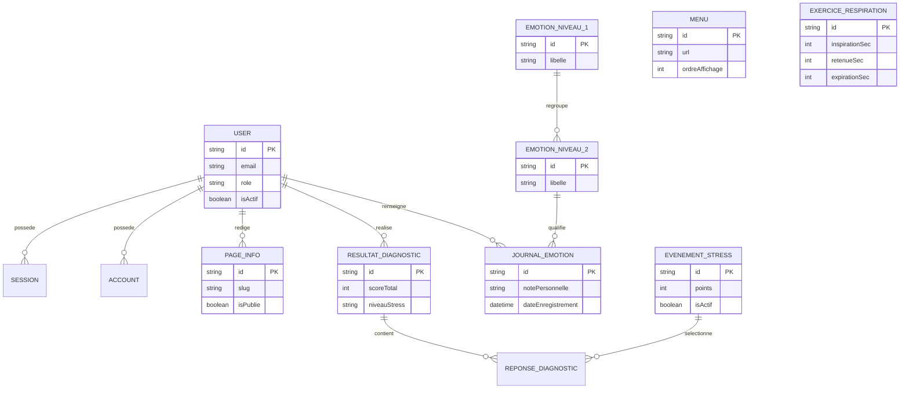

# Conception base de donnees CESIZen

Ce document complete le schema Prisma en fournissant une lecture MCD/MLD des donnees utiles au prototype Bloc 2.

## MCD simplifie

## MLD

| Table                  | Cle primaire                | Cles etrangeres                                                              | Role fonctionnel                                                                 |
| ---------------------- | --------------------------- | ---------------------------------------------------------------------------- | -------------------------------------------------------------------------------- |
| `user`                 | `id`                        | -                                                                            | Comptes utilisateurs et administrateurs, statut actif, consentement RGPD.        |
| `session`              | `id`                        | `userId -> user.id`                                                          | Sessions Better Auth. Suppression en cascade lors de la suppression utilisateur. |
| `account`              | `id`                        | `userId -> user.id`                                                          | Identifiants Better Auth, dont mot de passe hash.                                |
| `verification`         | `id`                        | -                                                                            | Jetons de verification Better Auth.                                              |
| `page_info`            | `id`                        | `auteurId -> user.id`                                                        | Pages de contenu publiees dans le module Informations.                           |
| `menu`                 | `id`                        | -                                                                            | Navigation front-office administree.                                             |
| `evenement_stress`     | `id`                        | -                                                                            | Evenements et points du diagnostic Holmes et Rahe.                               |
| `resultat_diagnostic`  | `id`                        | `utilisateurId -> user.id`                                                   | Historique des diagnostics sauvegardes.                                          |
| `reponse_diagnostic`   | `(resultatId, evenementId)` | `resultatId -> resultat_diagnostic.id`, `evenementId -> evenement_stress.id` | Evenements coches lors d'un diagnostic.                                          |
| `emotion_niveau_1`     | `id`                        | -                                                                            | Familles d'emotions.                                                             |
| `emotion_niveau_2`     | `id`                        | `emotionN1Id -> emotion_niveau_1.id`                                         | Emotions detaillees disponibles dans le journal.                                 |
| `journal_emotion`      | `id`                        | `utilisateurId -> user.id`, `emotionN2Id -> emotion_niveau_2.id`             | Journal d'emotions utilisateur.                                                  |
| `exercice_respiration` | `id`                        | -                                                                            | Exercices de respiration proposes aux visiteurs.                                 |

## Choix de modelisation

- Les suppressions utilisateur sont traitees par desactivation/anonymisation pour conserver la coherence des historiques tout en limitant les donnees personnelles.
- Les contenus informationnels sont separes des menus pour permettre a l'administrateur de publier une page sans l'exposer automatiquement dans la navigation.
- Les reponses diagnostic utilisent une table d'association afin de conserver le detail des evenements coches, pas seulement le score final.
- Les emotions sont hierarchisees en deux niveaux pour respecter la fonctionnalite de configuration demandee au back-office.
